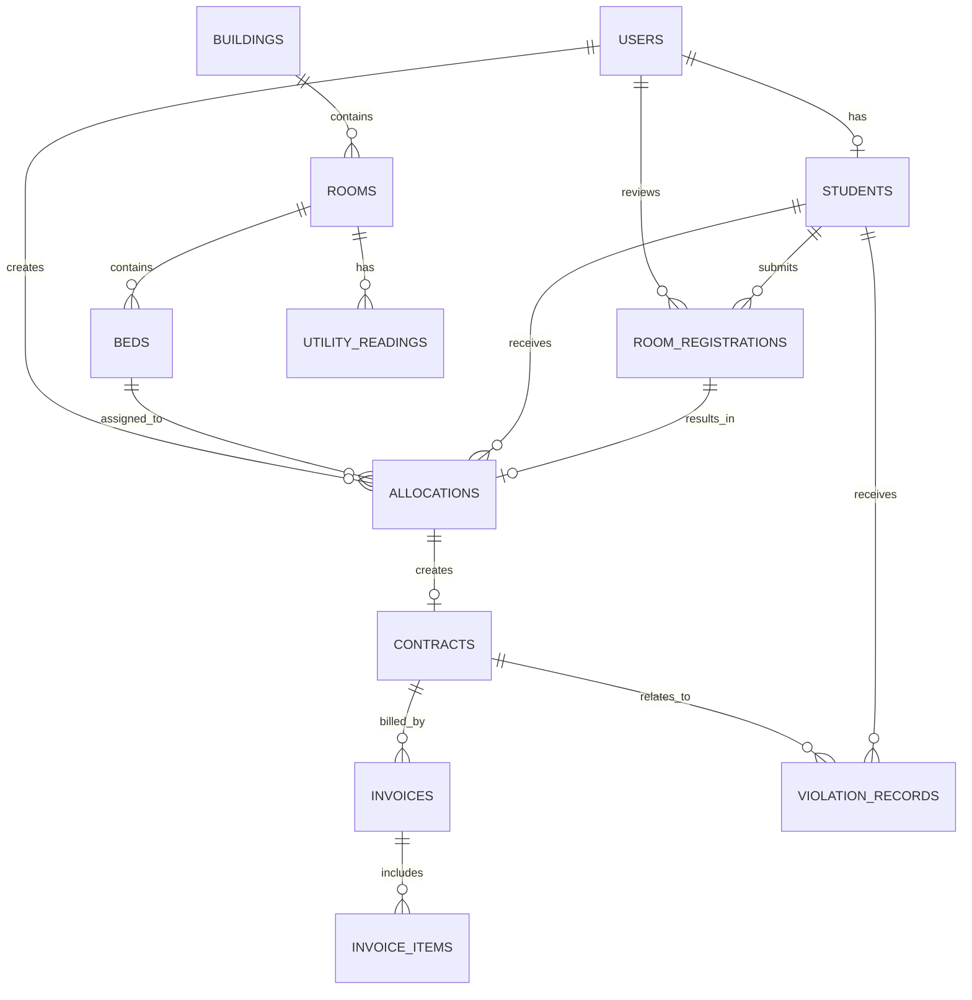

# Quản lý ký túc xá và đăng ký chỗ ở

## Chức năng các module

| Module | Chức năng chính |
| --- | --- |
| Người dùng & sinh viên | Đăng nhập, phân quyền `student`/`manager`, cập nhật hồ sơ sinh viên. |
| Danh mục ký túc xá | Quản lý tòa nhà, phòng, giường và trạng thái còn trống. |
| Đăng ký & xét duyệt | Sinh viên đăng ký theo học kỳ; cán bộ xét duyệt hoặc từ chối. |
| Phân chỗ & hợp đồng | Cấp giường sau khi duyệt, lập và theo dõi hợp đồng ở. |
| Điện nước & hóa đơn | Ghi chỉ số phòng, lập hóa đơn và các dòng chi tiết. |
| Kỷ luật | Ghi nhận vi phạm, tiền phạt và trạng thái xử lý. |

## ERD



## Data Dictionary

Ký hiệu: **PK** khóa chính, **FK** khóa ngoại, **UQ** duy nhất. Mọi bảng có `id` (bigint, PK), `created_at`, `updated_at`.

| Bảng | Cột nghiệp vụ | Mô tả / ràng buộc |
| --- | --- | --- |
| `users` | name, email, password, role, status | Tài khoản; email UQ, role mặc định `student`, status là boolean. |
| `students` | user_id, student_code, date_of_birth, gender, class_name, faculty, phone, address, priority_type | Hồ sơ SV; user_id FK/UQ, student_code UQ. |
| `buildings` | name, code, address, total_floors, gender_type, status, description | Tòa nhà; code UQ; status mặc định `active`. |
| `rooms` | building_id, room_number, floor, room_type, gender_type, capacity, monthly_price, status | Phòng; UQ(building_id, room_number). |
| `beds` | room_id, bed_number, status, description | Giường; UQ(room_id, bed_number). |
| `room_registrations` | student_id, semester, academic_year, preferred_room_type, priority_score, status, note, reviewed_by, reviewed_at, rejection_reason | Đơn đăng ký; UQ(student_id, semester, academic_year); reviewed_by FK users. |
| `allocations` | registration_id, student_id, bed_id, allocated_by, start_date, end_date, status, note | Phân giường; registration_id UQ; các cột *_id là FK. |
| `contracts` | allocation_id, contract_code, start_date, end_date, monthly_price, deposit_amount, status, signed_at, terminated_at, termination_reason | Hợp đồng; allocation_id và contract_code UQ. |
| `utility_readings` | room_id, reading_month, reading_year, previous/current_electricity, previous/current_water, electricity_unit_price, water_unit_price, recorded_by, recorded_at | Chỉ số điện nước; UQ(room_id, reading_month, reading_year). |
| `invoices` | contract_id, invoice_code, billing_month, billing_year, total_amount, due_date, paid_at, status, created_by | Hóa đơn; invoice_code UQ, UQ(contract_id, billing_month, billing_year). |
| `invoice_items` | invoice_id, item_type, description, quantity, unit_price, amount | Chi tiết một khoản trên hóa đơn. |
| `violation_records` | student_id, contract_id, recorded_by, violation_date, violation_type, description, penalty_amount, status, resolved_at | Vi phạm của SV; contract_id có thể rỗng. |

## Quy ước trạng thái

- `rooms`/`beds`: `available`, `occupied`, `maintenance`.
- `room_registrations`: `pending`, `approved`, `rejected`, `cancelled`.
- `allocations`/`contracts`: `active`, `ended`, `cancelled`.
- `invoices`: `unpaid`, `paid`, `overdue`, `cancelled`.
- `violation_records`: `pending`, `resolved`, `cancelled`.

## Chạy dự án

```bash
php artisan key:generate
php artisan migrate:fresh --seed
```

SQLite là cấu hình mặc định trong `.env`; với MySQL, cập nhật các biến `DB_*` rồi tạo database trước khi chạy lệnh trên.

## Repository và phân công nhánh

Repository cục bộ đã được khởi tạo với nhánh `main`. Các nhánh chức năng đã tạo:

- `feature/user-student`: người dùng và hồ sơ sinh viên.
- `feature/dormitory-catalog`: tòa nhà, phòng, giường.
- `feature/registration-allocation`: đăng ký, xét duyệt, phân chỗ, hợp đồng.
- `feature/billing-violations`: điện nước, hóa đơn, vi phạm.
