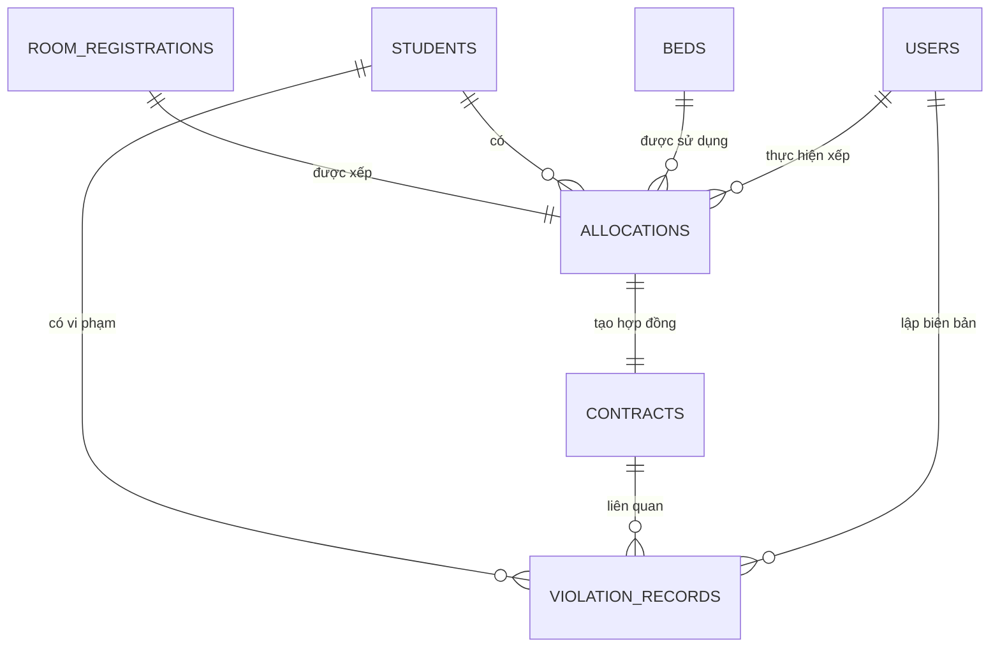

# ERD phần Thành viên 3

## Khóa ngoại

- `allocations.registration_id` → `room_registrations.id` (duy nhất).
- `allocations.student_id` → `students.id`.
- `allocations.bed_id` → `beds.id`.
- `allocations.allocated_by` → `users.id`.
- `contracts.allocation_id` → `allocations.id` (duy nhất).
- `violation_records.student_id` → `students.id`.
- `violation_records.contract_id` → `contracts.id` (có thể null).
- `violation_records.recorded_by` → `users.id`.
